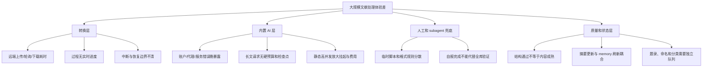
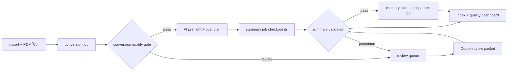

# paper-cli 早期实战工作流复盘与改进建议

日期：2026-07-30

## 目的与证据边界

本文复盘两个早期、大规模光核文献库任务中暴露出的产品问题：

- `019eb714-0570-7383-a3a8-fa20ce9a818b`（2026-06-11 起）
- `019f70d7-0534-7c62-bc76-f866bd5c5f56`（前者的后续会话）

它们不是受控性能基准。结论基于当时的命令记录、运行产物、用户中断决策、后续质量审计和本仓库当前实现交叉得出。外部服务的网络、价格、账户和模型行为已经可能变化，因此本文把它们分为：历史已观察事实、当前代码仍可确认的缺口、以及需要重新实测的假设。

这个复盘的核心结论是：早期系统能保存 bundle 和最终结果，但没有把“大规模、付费、远端、可中断”的处理过程变成可观察、可恢复、可控成本的作业系统。于是用户只能用 Codex subagent 逐篇兜底；该做法可完成任务，却将产品能力迁移到临时提示词、人工分批和一次性脚本中，速度与一致性都不可接受。

## 第一轮实施记录（2026-07-30）

本轮实施 P0 的可观察性与防失控部分，刻意没有提前实现 P1 的 checkpoint 或 P2 的质量队列：

- `convert`、`repair`、`extract summary` 与 `memory build` 现在会向 stderr 输出 compact progress，并把 `run-started`、`paper-started`、`stage-started`、`retrying`、`paper-finished`、`paper-failed`、`run-finished` 等非秘密事件追加到 `indexes/runs.jsonl`。既有 `indexes/jobs.jsonl` 继续只记录转换历史，`--json` 的 stdout 仍是最终 JSON，便于 agent 解析。
- OpenAI-compatible provider 现在对每次 HTTP 调用施加独立的 wall-clock 上限；`PAPER_AI_TIMEOUT_SECONDS` 或 `--request-timeout-seconds` 可配置该上限。超时会把调用返回给主流程并按既有 retry/failure 规则记录，而不会继续无输出地阻塞用户。
- 新增 `paper provider doctor --json`，以带鉴权的 `GET /models` 验证 provider 配置、凭证和网络连通性，且不发送论文正文或打印密钥。
- `paper extract summary` 新增 `--paper-timeout-seconds` 与 `--max-ai-seconds`。它会把剩余时间传递给 OpenAI-compatible 请求上限，使长文和整次批处理在预算到期时变为可报告的失败条目。

验证包括 provider 硬时限、health check、CLI JSON 无秘密输出、运行事件 JSONL/stderr，以及完整原有测试套件。该实现提供的是“用户可见的返回 deadline”，而不是对任意第三方 HTTP 客户端的操作系统级强制终止；可取消连接、摘要 checkpoint/resume、体量自适应并发和成本估算仍属于 P1，不能宣称已关闭。

## 任务背景

两个会话共同完成了从广泛检索、PDF 获取、导入、转换、AI 摘要到逐篇质量复核的一条长链路。实际规模在不同阶段持续变化：最初可确定导入的 OA PDF 是 20 篇；随后分类主库扩展到数百篇；后续一次全库只读审计覆盖 380 个 bundle；最终成熟度复核覆盖 502 个 bundle。规模变化本身说明，不能用一次单篇 smoke test 推断全库体验。

早期用户提出的主要感受是：

1. 多篇文章处理慢，且终端长期无输出，难以判断是正常等待还是卡住。
2. 内置 AI 在全库操作中几乎不可用，后来改为 Codex/subagent 按统一格式处理。
3. subagent 逐篇检查虽然绕开了服务故障，但调度、复核和最终一致性检查仍耗费大量时间。

以下问题树将这三点展开。

## 问题树

## 发现一：转换速度慢，而且“静默”放大了慢的感受

### 已观察事实

- 早期默认单文件 MinerU API 路径会经历上传、远端轮询、ZIP 下载和归一化。一次受控复现中，`pn-048` 单篇约用了 3 分 55 秒；20 篇任务最终全部完成，说明“没有输出”并不等于死锁。
- 当时的上传与 ZIP 下载分别可等待 120 秒，并带网络重试；`MINERU_MAX_WAIT_SECONDS` 只约束远端轮询阶段，不是整篇 PDF 的端到端 deadline。将它调小不能可靠缩短上传或下载的等待。
- 外层 ingest 使用阻塞式子进程等待，也没有转发转换过程中的持续状态。这使 CPU 低、终端静默、浅层目录检查都很容易被误判为挂起，并曾导致过早中止。
- 另一次 30 篇现实验证中，远端任务超过 10 分钟，阻塞了剩余串行工作。这确认了单个坏任务会拖慢批处理的风险。

### 后续已缓解的部分

当前默认已切换为 `mineru-api-batch`；README 和代码均表明其具有分块上传、受限并发、远端 `batch_id`/`data_id`、恢复运行中 batch 和长 PDF 拆分能力。严格 doctor 也会检查悬挂转换状态。这比早期单文件路径好得多。

### 当前仍可确认的缺口

- CLI 仍只在命令结束时向 stdout 输出最终 JSON；转换期间没有标准化的 stderr 事件流、进度百分比、当前 batch/paper、最近远端状态、耗时或 ETA。
- 旧 `mineru-api` 后端仍存在独立的上传与下载 120 秒请求；它的总等待和重试时间对用户不可见。即使默认已迁移，显式选择该后端的用户仍会遇到同类体验。
- 批量后端的恢复是远端 batch 级恢复；文档和现有验证没有证明在“上传完成一部分、下载完成一部分、进程被杀”的每个边界上都具有可审计的细粒度恢复。
- 转换完成的结构状态不代表文本质量。扫描件、HTML 伪 PDF、页数异常、低信息 Markdown 仍会在后续摘要和人工审查阶段暴露。

## 发现二：内置 AI 失败不只是“模型不好”，而是失败模型不适合全库作业

### 已观察事实

- 早期内置 AI 的配置被成功加载，但全库摘要曾收到 DeepSeek `402 Payment Required`；另有代理返回 `500 Internal Privoxy Error`。这说明一部分失败来自账户和网络，不是环境变量是否存在的问题。
- 在一篇超大 bundle 上，MinerU 已完成转换和分段，但 AI 摘要进程超过 15 分钟仍无输出：337 页、约 8,837 行 Markdown、约 514 张图、bundle 约 113 MB；本地 CPU 接近零，两个 HTTPS 连接保持建立，最终 `summary.json` 未生成，而用户已观察到计费继续。
- 同一阶段的 memory refresh 对空 `summary_blocks` 出现过 `IndexError`。即使提取层的某些工作完成，后续 memory 层也可能将命令表现为整体失败。
- 全库 `repair --dry-run` 也曾经因 provider 请求链在本地代理中停留数分钟而被手动停止。

### 当前仍可确认的缺口

- `OpenAICompatibleProvider` 只有 requests 级 `timeout_seconds`。当前 `extract summary` 没有公开的“单请求硬 wall-clock、单篇总时限、整次命令总预算”参数，也没有可取消的 provider 调用抽象。
- `extract_summary.py` 仅在全部 block、section 和 graph 请求成功后，才原子写入最终三个文件。该原子性防止了不完整正式结果，却也意味着在最后一段失败或被中断时，已支付的 block 结果不可恢复。
- 当前默认 `--workers 16`、`--paper-workers 16`、`--max-requests 500`。全局信号量限制请求数，但没有依据页数、Markdown 长度、batch 数、provider 限流或费用预算自动调低。对正常短文可快，对长文和不稳定服务会并发放大风险。
- `--dry-run` 只列出候选处理范围，不能输出每篇的页数/行数、预测 batch 数、可能的请求数、风险等级、建议并发或成本上界。因此用户无法在开始前作出知情选择。
- `paper doctor` 只能诊断配置是否存在，不能做不泄露正文的 provider 鉴权/额度/连通性 preflight，也不能把该健康状态记录到本次 run。

## 发现三：subagent 兜底完成了任务，但没有形成产品级吞吐与质量闭环

### 已观察事实

- 用户明确因为“这样做太慢”而停止内置 AI，转为多个 subagent 逐 collection、逐篇生成或重写 `summary.json`、`summary.md` 和 `source-map.json`。
- 这些 subagent 通常声明未调用 `paper extract summary`、未调用任何外部 AI API，改由 `codex-subagent/manual-literature-review` 产生结构化结果。它们还各自写了 collection 内脚本和报告。
- 一次 380 bundle 的后续独立审计发现：124 篇 source-map 的 Markdown hash 已过期；6,772 个 summary block 中约 3,535 个（约 52.2%）触发 shallow 规则；35 篇没有 graph nodes、60 篇没有 graph edges；元数据存在年份、作者、DOI/标题重复和路径可移植性问题。由此可见，“所有文件都存在且 JSON 可解析”并不代表内容成熟。
- 更晚的 502 bundle 质量流程也验证了这一点：批次自报完成后，独立全库验证仍发现 30 个问题，才通过二次修复达到结构验证的 0 issues。

### 根因判断

subagent 的优势是上下文判断、能阅读异常 PDF/Markdown、能处理不规则题录；缺点是执行协议没有被 paper-cli 吸收：质量规则存在于任务提示、局部脚本和人工记忆中，而不是一个带版本、队列、状态、验收器和可重试策略的库内工作流。

因此，subagent 不应继续充当默认的逐篇抽取引擎。它应成为少量异常 bundle 的人工审查执行者，并把审查结论以稳定的 review artifact 写回库中。

## 发现四：质量、命名、分类和处理状态被混为“已完成”

早期操作中曾出现以下混淆：

- `paper doctor --strict` 通过，说明 bundle 合约和转换状态基本正确，却不能证明摘要深度、分类准确性、DOI、作者、首页题名或来源质量正确。
- MinerU 标题可能包含全大写期刊名、乱码、路径字符或公式片段；自动重命名会把抽取错误扩大为同步路径和索引错误。当前已有标题质量 guard 与 `rename_on_convert` 配置，这是必要缓解，但它不是题录核验。
- source-map 只要跟随 `paper.md` 改写就会失效；如果没有“摘要输入 hash 变更后进入复核队列”的统一规则，旧摘要看似完整却不再可追溯。
- PDF 获取阶段可能得到 HTML、403 落地页或错误 PDF；`is_oa` 不是可下载 PDF 的保证。后续抽取再成功也不能修复错误源文件。

这表明 `converted`、`summarized`、`metadata_reviewed`、`classified`、`content_reviewed`、`source_map_current` 和 `needs_human_review` 必须是分离状态，不能由一个“done”代替。

## 目标工作流

建议将未来全库处理建模为可恢复的本地作业队列，而不是一个长命令或临时 agent 编排：

关键原则：

- 正式输出仍保持原子提交；中间检查点必须单独、可校验、可清理，且不能被后续消费者误认为正式摘要。
- 每个 run 都有稳定 ID、配置快照（去除秘密）、输入 hash、provider/model、并发、预算、阶段事件和结果计数。
- 正常文献走自动化；只有明确的失败、低质量、超大文档和语义不确定条目进入 review queue，再交给 Codex/subagent。
- 质量 gate 和 review queue 必须是 CLI 的一等输出，而不是把 warning 埋在某个 JSON 内。

## 改进路线图

### P0：让长任务可观察、可停止、可诊断

优先级最高，先于继续提高并发或添加新模型。

1. 为 convert、repair、extract summary、memory build 增加统一的 JSONL 作业事件写入和人类可读 stderr 进度。stdout 的 `--json` 仍只保留最终结果。
2. 事件至少包括 `run_started`、`paper_started`、`stage_started`、`checkpoint_written`、`retrying`、`paper_finished`、`paper_failed`、`run_finished`，含 paper ID、阶段、耗时、attempt、并发槽位和非敏感错误分类。
3. 为 provider 增加 `--request-timeout-seconds`、`--paper-timeout-seconds`、`--max-ai-seconds`；超时后写出可重试状态并继续其他 paper，绝不只留下静默进程。
4. 添加 `paper provider doctor` 或等效的 `doctor --provider-check`：只执行小型、无论文正文的鉴权/连通性检查，明确报告 credential、HTTP 类别、代理提示与模型名；不得打印秘密。

验收：对一个被测试 provider 永久阻塞的 fake server，CLI 在每个配置 deadline 内返回；`jobs.jsonl` 可说明最后完成到哪一篇哪一阶段；`--json` stdout 仍可由 `json.loads` 解析。

### P1：使 AI 摘要可恢复、可预算且对长文自适应

1. 在 `extracts/summary/.partial/<run-id>/` 写入按 block batch 划分的、带输入 hash 和 schema 版本的 checkpoint；只在全部必需数据校验后原子发布正式 summary。
2. 重跑时复用同输入 hash 的成功 checkpoint；输入变更、schema 变更或 provider/model policy 不兼容时明确作废，而不是静默混用。
3. 让 dry-run 输出逐篇计划：PDF 页数（可得时）、Markdown 行/字符数、可摘要 block 数、batch 数、预计请求数、长文风险、推荐 `workers/paper-workers/max-requests` 和现有产物是否会跳过。
4. 根据体量自动限制并发并缩小 batch；对超过阈值的文档默认进入 `requires_confirmation` 或 review queue。默认全局请求上限应保守，500 只作为明确 opt-in。
5. 增加 provider 使用量记录和可选硬上限；不能精确估价时至少记录请求数、输入/输出 token（若 API 返回）及超时前的未知使用量。

验收：中断一篇多 batch 长文后，重新运行不重复调用已完成 batch；dry-run 不发 provider 请求；超大文档不能在默认设置下开启数百个付费并发连接。

### P2：将质量控制从临时 subagent 提示词收敛到可版本化合同

1. 定义 `quality.json` 或扩展 `summary.json` 的独立质量状态：source PDF、conversion、metadata、classification、summary depth、traceability、review 的状态与证据分开存储。
2. 提供 `paper audit`：验证 PDF 头与哈希、bundle 合约、source-map 新鲜度、block/line/text hash、摘要覆盖/深度、重复 DOI/标题、题录完整性、目录可移植性和 collection 一致性；输出 machine-readable review queue。
3. 使 `paper status --json` 汇总这些维度，而不是只给 converted/failed/pending。
4. 将 Codex 审查的输入收敛成一个 paper-level review packet（原文片段、题录冲突、分类候选、失败原因、验收规则），将输出限制为可验证 patch 或 `review_decision.json`，禁止以无记录的自由格式替换主链路。
5. 在 schema 中写明 summary 的“结构合格”和“内容成熟”是两个等级；不把警告清零等同于学术结论正确。

验收：修改 `paper.md` 后，旧 source-map/summary 自动被标为 stale；全库 audit 能复现 380/502 类审计中发现的 hash、浅摘要、元数据和目录问题；任何 subagent 结果都必须经过同一 validator 才能标记为 reviewed。

### P3：转换后端与运行策略进一步产品化

1. 明确 `mineru-api` 为兼容/单文件后端，并在多篇 pending 时提示使用 batch；以 batch/local 为推荐路径。
2. 为每篇转换实施端到端 deadline，不只限制轮询；记录上传、远端等待、下载、归一化各阶段耗时与重试。
3. 为异常 PDF 建立转换质量 gate（空/极短 Markdown、HTML 伪 PDF、扫描件 OCR、页数限制、图像异常），自动送 review queue，而不是把所有 fallback 结果标成转换成功。
4. 为批处理恢复设计故障矩阵：上传前中断、部分上传、远端运行、部分 ZIP 下载、归一化失败、进程中断、远端 batch 过期；每种路径都要有幂等重跑测试。

## 不建议采取的做法

- 不建议仅把默认并发继续调大。它会提高健康短文的吞吐，却会把服务拥塞、账户失效和长请求的费用风险放大。
- 不建议把 Codex/subagent 当作每篇文献的永久默认处理器。它难以提供确定的吞吐、成本、运行状态与跨批一致性。
- 不建议用 `doctor --strict` 通过证明“成熟文献库”。它是结构/状态检查，不是内容、题录和分类的学术质量证明。
- 不建议用更短的单一 `MINERU_MAX_WAIT_SECONDS` 解决“卡住”。它无法覆盖上传、下载、外层进程等待和 AI provider 等不同阶段。

## 建议的实施顺序

第一迭代只做 P0，先建立统一作业事件、超时边界和 provider preflight。第二迭代做摘要 checkpoint 与 size-aware plan；这两项会直接减少重复计费和无效等待。第三迭代实现 `paper audit` 与 review queue，把 Codex 变成异常处理器而非全量替代品。完成前三项后，才重新进行一轮具有固定样本、固定 provider、固定预算和故障注入的 100+ 篇端到端验证。

## 现状核对清单

本文写作时，以下后续改进已经存在，不能再被当作未实现问题：批量 MinerU 后端、长 PDF 分段、转换 job 记录、严格 doctor 对悬挂转换的检查、`repair.json`/bundle 备份、摘要的 block/section/graph 追溯、摘要请求重试、CLI 内部并发，以及 memory stale 状态。

以下仍需要以代码实现和真实服务验证关闭：运行中 progress/event stream、AI 的硬 wall-clock/paper/command budget、可恢复的 AI checkpoint、按体量的自动并发与风险门槛、dry-run 成本计划、provider 可用性/额度 preflight、独立质量状态与 audit/review queue、以及上述故障矩阵的端到端验证。

## 参考证据

- 会话 `019eb714-0570-7383-a3a8-fa20ce9a818b`：早期导入、MinerU 静默转换诊断、全库 AI/subagent 处理和质量复核。
- 会话 `019f70d7-0534-7c62-bc76-f866bd5c5f56`：后续重现、用户放弃内置 AI 并转向 subagent、质量审计和命名/分类修复。
- `docs/development/2026-06-15-ai-summary-long-document-reliability.md`：337 页长文的 provider 卡顿、空摘要 memory crash、checkpoint/progress/budget 建议。
- `TODO.md`：MinerU batch、严格 doctor、AI 抽取并发和真实 smoke 的后续实现记录。
- `src/paper_cli/ai/extract_summary.py` 与 `src/paper_cli/ai/providers.py`：当前摘要并发、最终原子写入和 provider timeout 行为。
- `src/paper_cli/converters/mineru.py` 与 `src/paper_cli/converters/mineru_api_batch.py`：单文件和批量转换后端的阶段、timeout、恢复和分段行为。
